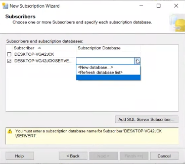

<h1 align="center"> Cơ Sở Dữ Liệu Phân Tán  
Đề tài: Quản Lý Tài Khoản Ngân Hàng </h1>

## Giới Thiệu
Tên tôi là: Trần Anh Dũng 

Mã sinh viên: N22DCCN014

Lớp: D22CQCN01-N 

Đây là đồ án tôi làm với môn Cơ Sở Dữ Liệu Phân tán do thầy Lê Hà Thanh giảng dạy. Đồ án này là đồ án thay cho bài thi cuối kì của tôi làm về đề tài quản lý tài khoản ngân hàng 

### Mục tiêu của dự án:
- Đảm bảo tính bảo mật và an toàn cho thông tin tài khoản.
- Hỗ trợ quản lý nhiều tài khoản ngân hàng trong một cơ sở dữ liệu phân tán.
- Cung cấp các báo cáo và thống kê giao dịch cho người dùng. 

### Công nghệ sử dụng:
- **Cơ sở dữ liệu**: SQL Server (hoặc bất kỳ hệ quản trị cơ sở dữ liệu phân tán nào khác).

Hệ thống sẽ được thiết kế để mở rộng và dễ dàng tích hợp với các dịch vụ khác trong tương lai.
## Các bước thực hiện phân tán ở server gốc. 
Bước 1: tạo publication mới. 

Bước 2: Chọn cơ sở dữ liệu mà mình muốn phân tán. Ở đây tôi chọn QLTKNH

Bước 3: Chọn cách phân tán ở đây tôi chọn merge publication

Bước 4: Chọn những bảng tôi muốn phân tán ra nhiều chi nhánh khác

Bước 5: Chọn 'Next'.

Bước 6:Chọn cơ sở dữ liệu mình muốn phân tán, ở đây tôi chọn QLTKNH. 

Bước 7: Chọn phương thức phân tán, ở đây mình chon Merge Pulication. Phương thức này giúp khả năng đồng bộ hóa từ hai chiều, giảm khả năng xung đột và khá linh hoạt. 

Bước 8:Chọn 'Next'.

Bươc 9: Chọn những bảng và những Stored Procedure. 

Bước 10: chọn 'Next'. 

## Các bước thực hiện phân tán ở server chi nhánh.

Do tôi đã thực hiện các bước này trước mà không chụp lại nên tôi sẽ lấy một ví dụ khác từ nguông Internet. Cách thức thực hiện tương tự. 

Bước 1: Từ Publication ở server gốc chọn "New súpcriptions". Rồi chọn "Next". 

Bước 2: Chọn database và Publication mình đã tạo lúc nãy. 

Bước 3: Nhấn "Next". 

Bước 4: Chọn "Add SQL Server ... " rồi chọn vào server chi nhánh mà chúng ta đã tạo. 

Bước 5: Chọn "New Database". 

Bước 6: Tạo database cùng tên với database mà mình muốn phân tán. rồi chọn Ok

Bước 7: CLick vào dấu ... 

Bước 8: Thao tác như hình và nhập tài khoản sa của server chi nhánh. Rồi chọn "Next". 

 

Bước 9: Chọn "Run continuosly" để đồng bộ dữ liệu ngay lập tức khi có các thay đổi.  

Bước 10: Chọn "Next". 

Và chờ kết quả. Chúc các bạn thành công. 
